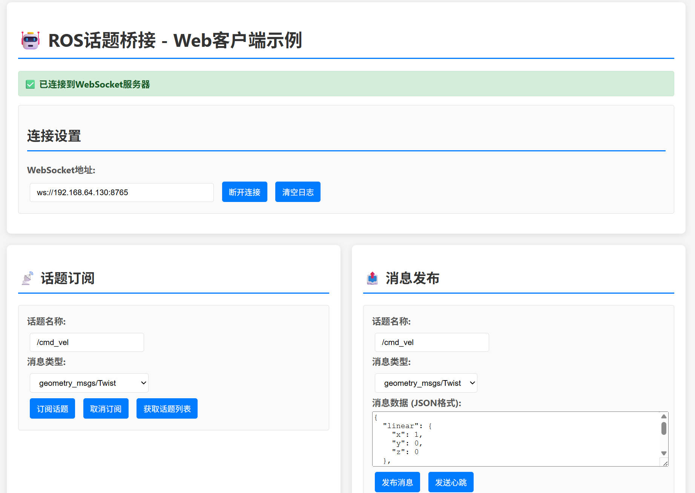
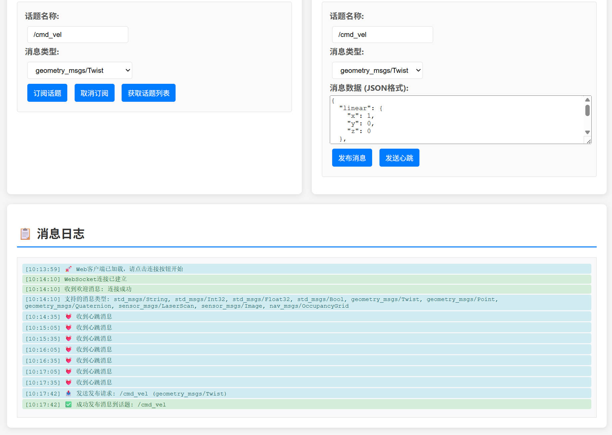

# ROS话题桥接节点 (Topic Bridge Node)

[](http://wiki.ros.org/)
[](https://www.python.org/)
[](LICENSE)

一个基于Python的ROS话题桥接节点，通过WebSocket协议实现ROS系统与Web前端的双向通信。支持实时话题订阅、消息发布、心跳检测和自动重连等功能。

## 🚀 主要特性

- **双向通信**: 支持Web端订阅ROS话题和发布消息
- **实时传输**: 低延迟的消息传输，确保实时性
- **多话题支持**: 同时处理多个ROS话题的订阅和发布
- **心跳检测**: 自动维持连接活性，支持断线重连
- **类型安全**: 支持多种ROS消息类型，自动类型验证
- **异常处理**: 完善的错误处理和日志记录机制
- **模块化设计**: 清晰的代码架构，易于扩展和维护

## 📋 系统要求

- **操作系统**: Ubuntu 18.04+ / Windows 10+ / macOS 10.14+
- **ROS版本**: ROS Melodic 或 ROS Noetic
- **Python版本**: Python 3.6+
- **网络**: 支持WebSocket连接的网络环境

## 🛠️ 安装指南

### 1. 克隆项目

```bash
cd ~/catkin_ws/src
git clone https://github.com/erk-zyn/ros2web.git topic_bridge
cd topic_bridge
```

### 2. 安装Python依赖

```bash
pip3 install -r requirements.txt
```

### 3. 编译ROS包

```bash
cd ~/catkin_ws
catkin_make
source devel/setup.bash
```

### 4. 验证安装

```bash
rospack find topic_bridge
```

## 🚀 快速开始

### 1. 启动ROS核心

```bash
roscore
```

### 2. 运行话题桥接节点

```bash
rosrun topic_bridge topic_bridge_node.py
```

或者使用launch文件：

```bash
roslaunch topic_bridge topic_bridge.launch
```

### 3. 连接Web客户端

#### 方法一：使用完整的Web客户端示例

项目提供了一个完整的Web客户端示例文件 `examples/web_client.html`，包含以下功能：

- **连接管理**：WebSocket连接/断开，自动重连机制
- **话题订阅**：支持多种消息类型的话题订阅和取消订阅
- **消息发布**：可视化界面发布ROS消息到指定话题
- **实时日志**：显示所有WebSocket通信和消息接收日志
- **话题列表**：获取当前可用的ROS话题列表
- **消息模板**：预设常用消息类型的JSON模板

**使用方法：**
1. 确保topic_bridge节点正在运行
2. 用浏览器打开 `examples/web_client.html` 文件
3. 点击"连接"按钮连接到WebSocket服务器
4. 使用界面进行话题订阅、消息发布等操作

**界面预览：**



#### 方法二：使用JavaScript代码

在浏览器中打开开发者工具，使用以下JavaScript代码连接：

```javascript
const ws = new WebSocket('ws://localhost:8765');

ws.onopen = function(event) {
    console.log('连接成功');
    
    // 订阅速度话题
    ws.send(JSON.stringify({
        type: 'subscribe',
        topic: '/cmd_vel',
        message_type: 'geometry_msgs/Twist'
    }));
};

ws.onmessage = function(event) {
    const message = JSON.parse(event.data);
    console.log('收到消息:', message);
};
```

## 📖 使用说明

### 支持的消息类型

| 消息类型 | 包名 | 描述 |
|---------|------|------|
| String | std_msgs | 字符串消息 |
| Int32 | std_msgs | 32位整数 |
| Float32 | std_msgs | 32位浮点数 |
| Bool | std_msgs | 布尔值 |
| Twist | geometry_msgs | 速度控制 |
| Point | geometry_msgs | 三维点坐标 |
| Quaternion | geometry_msgs | 四元数 |
| LaserScan | sensor_msgs | 激光雷达数据 |
| Image | sensor_msgs | 图像数据 |
| OccupancyGrid | nav_msgs | 占用栅格地图 |

### 基本操作

#### 订阅话题

```javascript
// 订阅激光雷达数据
ws.send(JSON.stringify({
    type: 'subscribe',
    topic: '/scan',
    message_type: 'sensor_msgs/LaserScan'
}));
```

#### 发布消息

```javascript
// 发布速度命令
ws.send(JSON.stringify({
    type: 'publish',
    topic: '/cmd_vel',
    message_type: 'geometry_msgs/Twist',
    data: {
        linear: { x: 1.0, y: 0.0, z: 0.0 },
        angular: { x: 0.0, y: 0.0, z: 0.5 }
    }
}));
```

#### 取消订阅

```javascript
// 取消订阅话题
ws.send(JSON.stringify({
    type: 'unsubscribe',
    topic: '/scan'
}));
```

#### 获取话题列表

```javascript
// 获取当前话题状态
ws.send(JSON.stringify({
    type: 'get_topics'
}));
```

### 配置参数

可以通过修改节点代码或使用ROS参数来配置：

```bash
# 设置WebSocket服务器地址和端口
rosparam set /topic_bridge/host "0.0.0.0"
rosparam set /topic_bridge/port 8765

# 设置心跳间隔（秒）
rosparam set /topic_bridge/heartbeat_interval 30
```

## 🏗️ 项目结构

```
topic_bridge/
├── CMakeLists.txt              # CMake构建文件
├── package.xml                 # ROS包配置文件
├── requirements.txt            # Python依赖列表
├── README.md                   # 项目说明文档
├── src/
│   └── topic_bridge_node.py    # 主节点文件
├── launch/
│   └── topic_bridge.launch     # 启动文件
├── docs/
│   └── websocket_protocol.md   # WebSocket协议文档
└── examples/
    ├── web_client.html         # Web客户端示例
    └── python_client.py        # Python客户端示例
```

## 🔧 高级配置

### 自定义消息类型

要支持自定义消息类型，需要在 `MessageTypeRegistry` 类中添加：

```python
class MessageTypeRegistry:
    MESSAGE_TYPES = {
        # 现有类型...
        'your_package/YourMessage': YourMessage,
    }
```

### 安全配置

在生产环境中，建议启用以下安全措施：

1. **使用WSS协议**（WebSocket Secure）
2. **实现身份验证机制**
3. **设置访问控制列表**
4. **限制连接数和消息频率**

### 性能优化

1. **消息过滤**: 对高频话题进行降采样
2. **压缩传输**: 对大数据量消息启用压缩
3. **连接池**: 复用WebSocket连接
4. **缓存机制**: 缓存常用的消息类型

## 🐛 故障排除

### 常见问题

#### 1. 连接失败

**问题**: WebSocket连接无法建立

**解决方案**:
- 检查节点是否正常运行：`rosnode list | grep topic_bridge`
- 确认端口未被占用：`netstat -an | grep 8765`
- 检查防火墙设置

#### 2. 消息接收不到

**问题**: 订阅话题后收不到消息

**解决方案**:
- 确认话题存在：`rostopic list | grep your_topic`
- 检查消息类型：`rostopic info /your_topic`
- 查看节点日志：`tail -f topic_bridge.log`

#### 3. 发布失败

**问题**: 无法发布消息到ROS话题

**解决方案**:
- 确认消息格式正确
- 检查话题权限
- 验证消息类型支持

### 调试工具

#### 查看日志

```bash
# 实时查看日志
tail -f topic_bridge.log

# 查看ROS节点日志
rosnode info /topic_bridge_node
```

#### 测试连接

```bash
# 使用wscat测试WebSocket连接
npm install -g wscat
wscat -c ws://localhost:8765
```

#### 监控话题

```bash
# 列出所有话题
rostopic list

# 查看话题信息
rostopic info /cmd_vel

# 监听话题消息
rostopic echo /cmd_vel
```

## 📚 API文档

详细的WebSocket通信协议请参考：[WebSocket协议规范](docs/websocket_protocol.md)

## 🤝 贡献指南

我们欢迎社区贡献！请遵循以下步骤：

1. Fork本项目
2. 创建特性分支：`git checkout -b feature/your-feature`
3. 提交更改：`git commit -am 'Add some feature'`
4. 推送分支：`git push origin feature/your-feature`
5. 创建Pull Request

### 代码规范

- 遵循PEP 8 Python代码规范
- 添加适当的注释和文档字符串
- 编写单元测试
- 确保代码通过所有测试

## 📄 许可证

本项目采用MIT许可证 - 详见 [LICENSE](LICENSE) 文件

## 🙏 致谢

- [ROS社区](https://www.ros.org/) 提供的优秀机器人操作系统
- [websockets](https://websockets.readthedocs.io/) Python库的开发者
- 所有为本项目做出贡献的开发者

## 📞 联系我们

- **项目主页**: https://github.com/erk-zyn/ros2web
- **问题反馈**: https://github.com/erk-zyn/ros2web/issues
- **作者**: erk-zyn
- **邮箱**: 1219534643@qq.com

## 🔄 更新日志

### v1.0.0 (2024-01-15)
- 初始版本发布
- 支持基本的话题订阅和发布功能
- 实现WebSocket通信协议
- 添加心跳检测和自动重连机制
- 完善的错误处理和日志记录

---

**⭐ 如果这个项目对您有帮助，请给我们一个Star！**